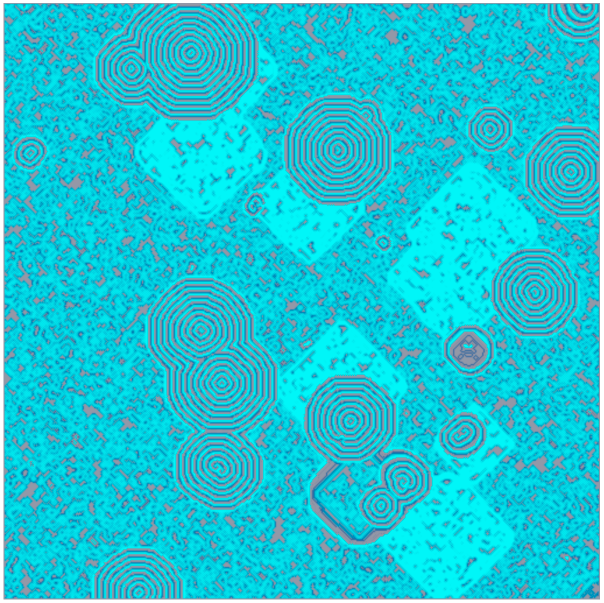

HodgePodgeJavaScript
====================

A JavaScript animation inspired by a chemical reaction called the 
Belousov-Zhabotinsky reaction. The reaction is described as a nonlinear
chemical oscillator, which sums it up fairly well.

The code is based on a Windows screensaver, which can be found at:

    https://github.com/thomasbratt/HodgePodgeScreensaver
    
The animation uses the HTML 5 Canvas tag, which may not work well with
some legacy browser versions. Making the canvas element too big
(1024x768) seems to result in the element not being displayed in newer browser
versions.

The algorithm used in this animation is described in Gary William Flake's
book *The Computational Beauty of Nature*. The animation is based on
this description, although C code is available (see references section).

Parameters
----------

The JavaScript HodgePodge class has working defaults, provided a canvas element
is present on the page.

The default parameters can be overriden in the constructor function, as follows:

	palette         	: The palette as 256 * 32 bit color values in
						  RGBA order.
	canvas      		: The canvas DOM element.
	numberOfStates		: The number of states in the cellular automata.
	k1              	: Controls infection rate of healthy cells by
						  damping the effect of infected neighbours.
	k2              	: Controls infection rate of healthy cells by
						  damping the effect of ill neighbours.
	g					: Controls progress of infected cells.

References
----------

* https://ccrma.stanford.edu/CCRMA/Courses/220b/Lectures/6/Examples/cbn/code/src/hp.c
* https://github.com/thomasbratt/HodgePodgeScreensaver
* http://mitpress.mit.edu/books/flaoh/cbnhtml/toc.html
* http://www.youtube.com/watch?v=bH6bRt4XJcw
* http://en.wikipedia.org/wiki/Belousov%E2%80%93Zhabotinsky_reaction

License
-------

MIT permissive license. See LICENSE.txt for full license details.     
     
Source Code Repository
----------------------
 
https://github.com/thomasbratt/BelousovZhabotinskyJavaScript

